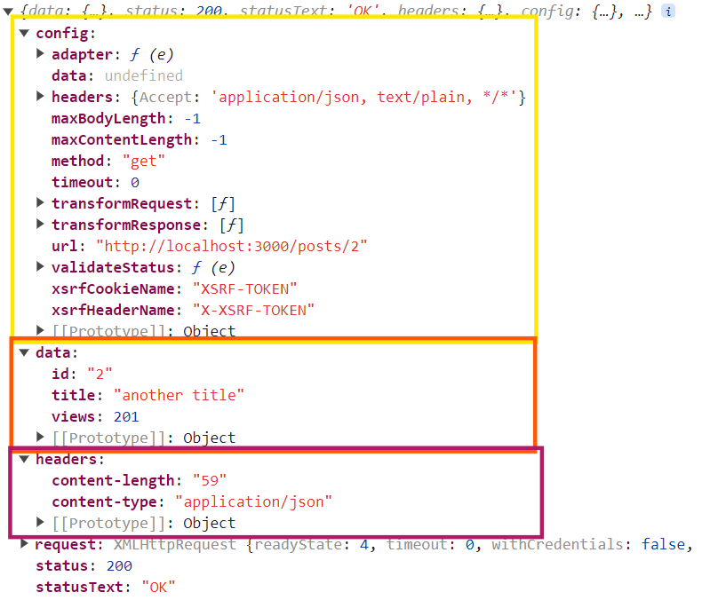
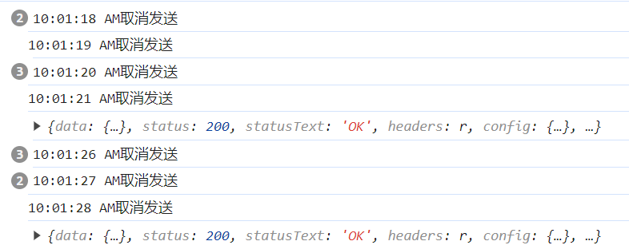
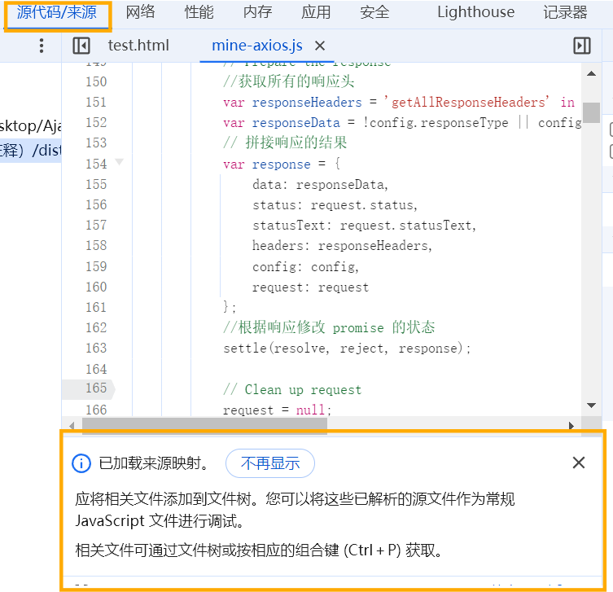
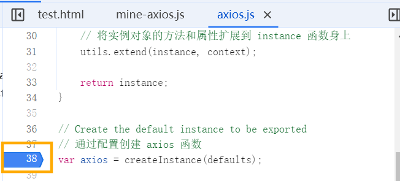
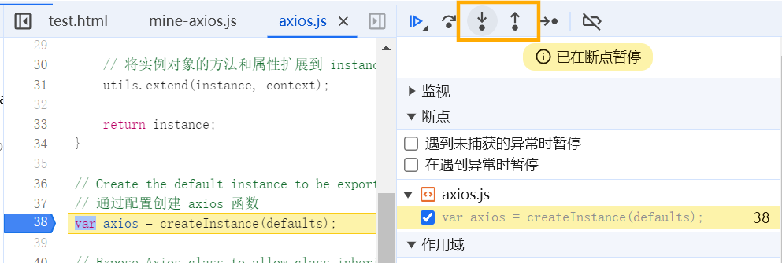

<a id="mulu">目录</a>
<a href="#mulu" class="back">回到目录</a>
<style>
    .back{width:40px;height:40px;display:inline-block;line-height:20px;font-size:20px;background-color:lightyellow;position: fixed;bottom:50px;right:50px;z-index:999;border:2px solid pink;opacity:0.3;transition:all 0.3s;color:green;}
    .back:hover{color:red;opacity:1}
    img{vertical-align:bottom;}
</style>

<!-- @import "[TOC]" {cmd="toc" depthFrom=3 depthTo=6 orderedList=false} -->

<!-- code_chunk_output -->

- [测试环境](#测试环境)
- [基本使用](#基本使用)
    - [发送Ajax请求](#发送ajax请求)
    - [响应结果的结构](#响应结果的结构)
    - [配置对象的其它参数](#配置对象的其它参数)
    - [默认配置](#默认配置)
    - [创建实例对象](#创建实例对象)
    - [拦截器](#拦截器)
    - [取消请求](#取消请求)
- [源码分析](#源码分析)
    - [目录结构](#目录结构)
    - [axios的创建过程](#axios的创建过程)

<!-- /code_chunk_output -->

<!-- 打开侧边预览：f1->Markdown Preview Enhanced: open...
只有打开侧边预览时保存才自动更新目录 -->

写在前面：此笔记来自b站课程[尚硅谷Web前端axios入门与源码解析](https://www.bilibili.com/video/BV1wr4y1K7tq) / [资料下载](https://pan.baidu.com/s/1TddRdJ-jsW53K8Gx-4pErw) 提取码：25lx

### 测试环境
使用json-server包：`npm i -g json-server`
创建`db.json`：
```json
{
  "posts": [
    { "id": "1", "title": "a title", "views": 100 },
    { "id": "2", "title": "another title", "views": 200 }
  ],
  "comments": [
    { "id": "1", "text": "a comment about post 1", "postId": "1" },
    { "id": "2", "text": "another comment about post 1", "postId": "1" }
  ],
  "profile": {
    "name": "typicode"
  }
}
```
启动服务：`json-server --watch db.json`
注：必须在`db.json`所在文件夹内的终端启动服务
### 基本使用
axios是一个基于promise的HTTP客户端，可以在浏览器和nodejs环境中运行
- 在浏览器端可以向服务端发送Ajax请求
- 在服务端可以发送HTTP请求

引入：
```html
<script src="https://cdn.bootcdn.net/ajax/libs/axios/0.21.1/axios.min.js"></script>
```
##### 发送Ajax请求
```js
//通用方法axios
axios({
    url: 'xxx',
    method: 'POST', //请求方法（默认为GET）
    params: {a: 100, b: 200}, //查询字符串
    headers: {my_header: 'header'}, //请求头
    data: {username: 'abc'}, //请求体
}).then(value => {
    //value中存储着响应结果、状态等信息
});
//request方法
axios.request({}).then(value => {}) //使用方法同axios

//get方法--发送get请求
axios.get(url, { //第二个参数是配置项
    params: {a: 100, b: 200}, //查询字符串
    headers: {name: 'abc'}, //请求头
}).then(value => {
    //value中存储着响应结果、状态等信息
});
//delete方法--发送delete请求
axios.delete({}).then(value => {}) //使用方法同get

//post方法--发送post请求
axios.post(url, { //第二个参数是请求体
    username: 'abc',
    password: 'xxx' //以json格式传递
}, { //第三个参数是配置项（同get）
    params: {a: 100, b: 200}, //查询字符串
    headers: {name: 'abc'}, //请求头
}).then(value => {
    //value中存储着响应结果、状态等信息
});
//put方法--发送put请求
axios.put({}).then(value => {}) //使用方法同post
//patch方法--发送patch请求
axios.patch({}).then(value => {}) //使用方法同post
```
**例**：分别发送GET、POST、PUT、DELETE请求
```html
<body>
    <button>发送GET请求</button>
    <button>发送POST请求</button>
    <button>发送PUT请求</button>
    <button>发送DELETE请求</button>
    <script>
        const btn = document.querySelectorAll("button");
        btn[0].addEventListener("click", () => {
            //获取第二篇post
            axios({
                method: 'GET',
                url: "http://localhost:3000/posts/2",
            }).then(res => {
                console.log(res);
            });
        });
        btn[1].addEventListener("click", () => {
            //添加一篇post
            axios({
                method: 'POST',
                url: "http://localhost:3000/posts",
                data: {
                    title: "woshibiaoti",
                    views: 300
                }
            }).then(res => {
                console.log(res);
            });
        });
        btn[2].addEventListener("click", () => {
            //更新第二篇post信息
            axios({
                method: 'PUT',
                url: "http://localhost:3000/posts/2",
                data: {
                    title: "another title",
                    views: 201
                }
            }).then(res => {
                console.log(res);
            });
        });
        btn[3].addEventListener("click", () => {
            //删除第一篇post
            axios({
                method: 'DELETE',
                url: "http://localhost:3000/posts/1",
            }).then(res => {
                console.log(res);
            });
        });
    </script>
</body>
```
##### 响应结果的结构
{:width=400 height=400}
- `config`：配置对象，包括请求url、请求类型、请求头、请求体等
- `data`：响应体，是一个对象（或一个元素为对象的数组），axios自动对服务器响应内容解析，转成对象的形式
- `headers`：响应头
- `request`：原生的Ajax请求对象`XMLHttpRequest`
- `status`：响应状态码
- `statusText`：响应状态字符串
##### 配置对象的其它参数
- `baseurl`：设定请求url的基础结构（协议和域名），这样url只写路径即可，在发送请求时axios会将其与url进行拼接
  比如在上例中，可以设置`baseurl: "http://localhost:3000/"`，这样url就可只写`"/posts/2"`
- `transformRequest`和`transformResponse`：分别对请求体数据和响应体数据进行处理
  ```js
  transformResponse: [function (data) {
    //处理数据
    return data;
  }]
  ```
- `paramsSerializer`（使用较少）：对查询字符串进行格式转换，比如`/post/a.100/b.200`
- `data`：请求体，如果是字符串就直接传递（如`a=100&b=200`，如果是对象就转成json字符串传递）
- `timeout`：超时时间，单位为ms，默认为0（没有超时限制），如果超过这个时间没有得到响应，就会返回reject的promise对象且取消请求
- `withCredentials`请求时是否携带cookie，默认不携带
- `adapter`发送Ajax请求还是HTTP请求
- `auth`（使用较少）登录时设置用户名和密码
- `responseType`设置响应体格式，默认是json，会自动转为对象
- `responseEncoding`响应体编码格式，默认是utf-8
- `xsrfCookieName`/`xsrfHeaderName`/`withXSRFToken`：cookie相关设置，分别是设置cookie名称/请求头名称/请求是否来自同一域名（起保护作用，避免跨站攻击，即为来自自己网页的请求加上特殊的唯一参数）
- `onUploadProgress`/`onDownloadProgress`上传/下载时的回调
- `maxContentLength`/`maxBodyLength`：响应体/请求体的最大尺寸（单位为字节）
- `validateStatus`什么时候响应成功，默认响应状态码以2开头
- `maxRedirects`向服务器发送请求时，最大跳转的次数（默认为5次），用在nodejs中
- `socketPath`socket文件位置
- `httpAgent`/`httpsAgent`（使用较少）：客户端设置
- `proxy`：设置代理，常用于爬虫中切换IP
- `cancelToken`：取消请求设置
- `decompress`：是否对请求结果解压，默认解压
##### 默认配置
`axios.defaults.配置项 = 值`，设置后在axios函数中就可以不写，会自动按这个默认值来
- `axios.defaults.method`请求类型
- `axios.defaults.baseurl`请求的baseurl
- 其实上面提到的所有配置项都可以设置默认值

```js
axios.defaults.baseURL = "http://127.0.0.1:9000/";
axios.defaults.method = 'GET';
axios.defaults.timeout = 1000;
axios.defaults.params = { id: 100 };
btn[0].addEventListener("click", () => {
    axios({
        url: "/axios",
    }).then(res => {
        console.log(res);
    });
});
```
##### 创建实例对象
作用是可以设置多套默认配置
```js
const axios_obj = axios.create({
    //设置默认配置项（使用该对象发送的请求都会有这些默认配置项）
});
axios_obj({ //使用方式同axios函数
    //其它配置项
}).then(value => {
    //value中存储着响应结果、状态等信息
});
//还有get等方法，例如
axios_obj.get(url, {
    //其它配置项
}).then(value => {
    //value中存储着响应结果、状态等信息
});
```
例：
```js
const axios1 = axios.create({
    baseURL: "http://localhost:3000/",
    timeout: 3000,
    method: 'POST'
});
const axios2 = axios.create({
    baseURL: 'http://127.0.0.1:9000',
    timeout: 3000
});
btn[0].addEventListener("click", () => {
    axios1({
        url: "/posts",
        data: {
            title: "woshibiaoti",
            views: 300
        }
    }).then(res => {
        console.log(res);
    });
});
btn[1].addEventListener("click", () => {
    axios2.get("/axios").then(res => {
        console.log(res);
    });
});
```
##### 拦截器
分为请求拦截器和响应拦截器
- **请求拦截器**：对请求的参数和内容作处理和检测，如果有问题，就取消发送请求
- **响应拦截器**：在得到响应结果前，先对响应结果进行预处理，例如响应失败时，可以作一些提醒和记录；还可以对响应结果进行一些格式化

```js
//请求拦截器
axios.interceptors.request.use(config => {
    //请求拦截器--成功
    return config;
}, error => {
    //请求拦截器--失败
    return Promise.reject(error);
});
//响应拦截器
axios.interceptors.response.use(response => {
    //响应拦截器--成功
    return response;
}, error => {
    //响应拦截器--失败
    return Promise.reject(error);
});
//发送请求
axios({}).then(v => {
    //得到响应
}).catch(r=>{
    //得到失败响应
});
```
- `config`：配置对象，这意味着我们可以在请求拦截器中对配置对象进行修改。例如`config.params={a:100}`
- `response`：axios的响应对象，不仅可以更改这个响应对象的内容，还可以通过修改return的值，来改变发送请求中`v`的值。例如`return response.data`，这样`v`就只有响应体内容，便于处理
如果在`请求拦截器--成功`中抛出异常/返回reject的promise对象，，则会继续依次执行`响应拦截器--失败`和`得到失败响应`中的代码
**多个拦截器的情况**：
```js
axios.interceptors.request.use(); //第一个请求拦截器
axios.interceptors.request.use(); //第二个请求拦截器
axios.interceptors.response.use(); //第一个响应拦截器
axios.interceptors.response.use(); //第二个响应拦截器
```
实际执行的顺序是`第二个请求拦截器`->`第一个请求拦截器`->`第一个响应拦截器`->`第二个响应拦截器`
即请求拦截器先声明的后执行，响应拦截器先声明的先执行
##### 取消请求
```js
let cancel = null; //声明全局变量
axios({
    cancelToken: new axios.CancelToken(c=>cancel=c) //在配置对象中设置取消请求的接口
});
cancel(); //调用函数即可取消请求
```
在取消请求后，会执行axios返回promise对象的失败回调
**例1**：点击一个按钮发送请求，点击另一个按钮取消
```js
let cancel = null;
btns[0].addEventListener("click", () => {
    axios({
        method: 'GET',
        url: 'http://127.0.0.1:9000/axios',
        cancelToken: new axios.CancelToken(c => cancel = c)
    }).then(v => {
        console.log(v)
    }).catch(r => {
        console.log("取消请求成功");
    });
});
btns[1].addEventListener("click", () => {
    cancel();
});
```
**例2**：对发送请求进行防抖处理，即发送请求后，如果检测到之前已经发送过且还没得到响应，就取消前一次的发送
方法：将上面的`cancel`变量作为锁，得到响应后将其设为`null`
```js
let cancel = null;
btns[0].addEventListener("click", () => {
    cancel && cancel(); //如果cancel有值，说明还没得到响应，取消；没值就不取消
    axios({
        method: 'GET',
        url: 'http://127.0.0.1:9000/axios',
        cancelToken: new axios.CancelToken(c => cancel = c)
    }).then(v => {
        console.log(v)
        cancel = null;
    }).catch(r => {
        console.log((new Date()).toLocaleTimeString() + "取消发送");
    });
});
```
{:width=200 height=200}
### 源码分析
##### 目录结构
- dist文件夹：打包后的最终输出的整体文件
  - `axios.js`/`axios.min.js`源码
  - `mine-axios.js`加了一些分析过程的源码
- lib文件夹：核心代码
  - adapters文件夹：适配器，定义http和Ajax请求
    - `http.js`：nodejs发送请求
    - `xhr.js`：网页中Ajax发送请求
  - cancel文件夹：取消请求
  - core文件夹：核心功能
    - `Axios.js`：Axios构造函数
    - `buildFullPath.js`：构造完整url的函数
    - `createError.js`：创建error对象
    - `dispatchRequest.js`：发送请求（使用上面的适配器）
    - `enhanceError.js`：更新错误对象
    - `InterceptorManager.js`：拦截器构造函数
    - `mergeConfig.js`：合并配置对象
    - `settle.js`：根据响应状态码改变promise对象状态
    - `transformData.js`：对请求和响应数据格式进行转换
  - helper文件夹：各种功能函数
  - `axios.js`：axios入口文件
  - `defaults.js`：默认配置
  - `utils.js`：各种工具函数
- `index.js`：整个包的入口文件
##### axios的创建过程
```html
<script src="../axios源码（中文注释）/dist/mine-axios.js"></script>
<script>
    console.log(axios);
</script>
```
在浏览器中打开，f12->源代码
{:width=400 height=400}
看到这行提示后，按`ctrl+p`找到入口文件`axios.js`，找到第38行，单击行号，设置断点
{:width=170 height=170}
之后刷新页面
{:width=200 height=200}
点击上下箭头即可查看上/下个函数调用
```js
//1.通过默认配置创建axios函数(axios.js)
var axios = createInstance(defaults);
//2.创建一个实例对象context(axios.js)
var context = new Axios(defaultConfig);
//3.Axios构造函数(Axios.js)
function Axios(instanceConfig){
    //给将Axios实例对象添加默认配置对象，拦截器对象
}
utils.forEach(['delete', 'get', 'head', 'options'], function forEachMethodNoData(method) { //给Axios原型添加各种发送请求的方法，这样Axios的原型对象就有了各种属性
    Axios.prototype[method] = ...;
});
//4.将request方法的this指向context，并返回新函数instance(axios.js)
var instance = bind(Axios.prototype.request, context);
//5.将Axios.prototype和实例对象context的方法和属性都添加到instance函数身上(axios.js)
utils.extend(instance, Axios.prototype, context);
utils.extend(instance, context);
//总的来说，就是先创建一个函数，再给它添加属性
```
最终结果：`instance`（代码中的axios对象）既是一个函数，又是一个有很多属性的对象，所以我们可以写`axios({})`，也可以写`axios.get({})`
